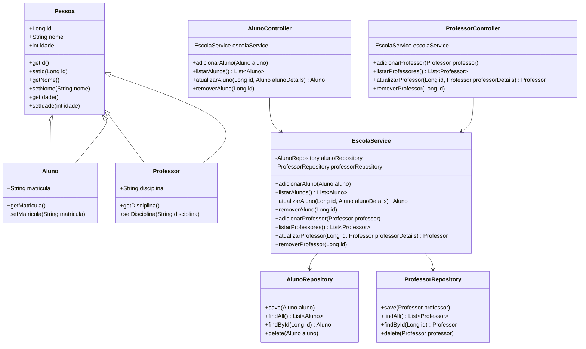

# Projeto Santander Dev Week 2024

JAVA RESTful API criado para o projeto

## Diagrama de Classes

```mermaid
classDiagram
    class Pessoa {
        +Long id
        +String nome
        +int idade
        +getId()
        +setId(Long id)
        +getNome()
        +setNome(String nome)
        +getIdade()
        +setIdade(int idade)
    }

    class Aluno {
        +String matricula
        +getMatricula()
        +setMatricula(String matricula)
    }

    class Professor {
        +String disciplina
        +getDisciplina()
        +setDisciplina(String disciplina)
    }

    Pessoa <|-- Aluno
    Pessoa <|-- Professor

    class AlunoRepository {
        +save(Aluno aluno)
        +findAll() List~Aluno~
        +findById(Long id) Aluno
        +delete(Aluno aluno)
    }

    class ProfessorRepository {
        +save(Professor professor)
        +findAll() List~Professor~
        +findById(Long id) Professor
        +delete(Professor professor)
    }

    class EscolaService {
        -AlunoRepository alunoRepository
        -ProfessorRepository professorRepository
        +adicionarAluno(Aluno aluno)
        +listarAlunos() List~Aluno~
        +atualizarAluno(Long id, Aluno alunoDetails) Aluno
        +removerAluno(Long id)
        +adicionarProfessor(Professor professor)
        +listarProfessores() List~Professor~
        +atualizarProfessor(Long id, Professor professorDetails) Professor
        +removerProfessor(Long id)
    }

    class AlunoController {
        -EscolaService escolaService
        +adicionarAluno(Aluno aluno)
        +listarAlunos() List~Aluno~
        +atualizarAluno(Long id, Aluno alunoDetails) Aluno
        +removerAluno(Long id)
    }

    class ProfessorController {
        -EscolaService escolaService
        +adicionarProfessor(Professor professor)
        +listarProfessores() List~Professor~
        +atualizarProfessor(Long id, Professor professorDetails) Professor
        +removerProfessor(Long id)
    }

    Pessoa <|-- Aluno
    Pessoa <|-- Professor

    AlunoController --> EscolaService
    ProfessorController --> EscolaService
    EscolaService --> AlunoRepository
    EscolaService --> ProfessorRepository
```

    
